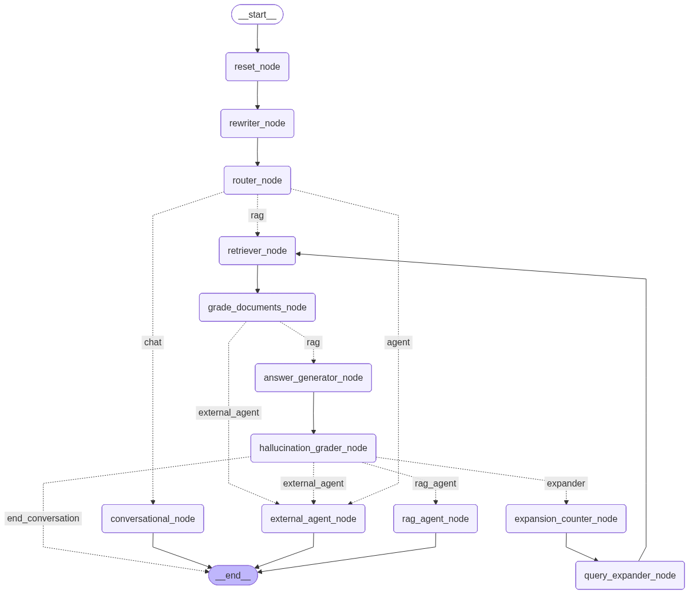

# 🚀 Advanced RAG Project


An **Advanced Retrieval-Augmented Generation (RAG)** system built with **LangGraph**, designed to be robust, self-correcting, and agentic. This project focuses on **high-precision retrieval** over cost efficiency, utilizing advanced techniques like contextual embeddings and hybrid search to minimize hallucinations.

## ✨ Key Features

-   **🧠 Agentic Workflow**: Uses [LangGraph](https://langchain-ai.github.io/langgraph/) to orchestrate a sophisticated state machine. The **Router** enhances speed by skipping RAG for simple conversational queries.
-   **🔍 Hybrid Search**: Combines **Dense Embeddings** (semantic) and **Sparse/BM25** (keyword) via [Qdrant](https://qdrant.tech/).
-   **🧩 Advanced Chunking**: Uses **Docling** for hybrid chunking, supporting complex document structures.
-   **💎 Contextual Embeddings**: Generates **Contextual Embeddings** and **Advanced Metadata** for better retrieval grounding.
-   **💾 Conversational Memory**: The system retains context across turns for a natural chat experience.
-   **🔄 Self-Correction**: Includes `HallucinationChecker` and `Grader` nodes to verify relevance and grounding.
-   **🕸️ Multi-Source Ingestion**:
    -   **Files**: PDF, TXT, DOCX, Excel, PPT, Markdown.
    -   **Web**: Crawls URLs (via `crawl4ai`).
    -   **Full Documentation**: Automatically detects and uses `llms-full.txt` or `sitemap.xml` endpoints to digest entire documentation libraries.
-   **📊 Observability**: Fully integrated with **LangSmith**.
-   **⚡ Speed & Cost**: Optimized for `gpt-4o-mini` for fast, cost-effective inference.

## 🏗️ Architecture



The system implements a cyclic graph workflow:

1.  **Rewrite Query**: Optimizes the user's question.
2.  **Route**: Directs traffic—simple greetings go to Chat (fast), complex queries go to RAG.
3.  **Retrieve**: Fetches top-k (7) documents using Hybrid Search.
4.  **Grade Documents**: Filters irrelevant content.
5.  **Generate**: Synthesizes an answer using **GPT-4o-mini**.
6.  **Hallucination Check**: Verifies if the answer is grounded.

## 🛠️ Tech Stack

-   **Language**: Python 3.11+
-   **Orchestration**: LangChain, LangGraph
-   **Vector DB**: Qdrant (Local)
-   **UI**: Streamlit
-   **LLM**: OpenAI GPT-4o-mini
-   **Ingestion**: Docling, Crawl4AI
-   **Observability**: LangSmith

## 🚀 Getting Started

### Prerequisites

-   Python 3.11+
-   **Playwright** (for web crawling)

### Installation

1.  **Clone the repository**
    ```bash
    git clone https://github.com/your-username/advanced-rag-project.git
    cd advanced-rag-project
    ```

2.  **Install dependencies**
    Recommended using `uv`:
    ```bash
    uv sync
    source .venv/bin/activate
    ```
    Or standard pip:
    ```bash
    pip install -r requirements.txt
    ```

3.  **Install Playwright** (Required for Crawl4AI)
    ```bash
    playwright install
    ```

4.  **Configure Environment**
    Create a `.env` file:
    ```env
    OPENAI_API_KEY=sk-...
    TAVILY_API_KEY=tvly-...
    LANGCHAIN_TRACING_V2=true
    LANGCHAIN_API_KEY=lsv2-...
    ```

## 📖 Usage

**Note**: The project comes pre-loaded with a knowledge base in `qdrant_db/` created from the `documents/` folder and `urls/urls.json`.

### 1. Ingest New Documents (Optional)
To update the knowledge base with new files (PDF, Docx, etc.) in `documents/` or links in `urls/urls.json`:

```bash
python src/document_ingestion/ingestion_pipeline.py
```

### 2. Run the Application
```bash
streamlit run streamlit_app.py
```

### 3. Run with Docker 🐳
Alternatively, you can run the application in a Docker container:

1.  **Build the image**:
    ```bash
    docker build -t advanced-rag-app .
    ```

2.  **Run the container**:
    ```bash
    docker run -p 8501:8501 --env-file .env advanced-rag-app
    ```
    *Ensure your `.env` file is properly configured before running.*


## ⚖️ Pros & Cons

| Aspect | Benefits | Challenges |
| :--- | :--- | :--- |
| **Accuracy** | **High Precision**. Contextual embedding + Hybrid Search + Self-Correction drastically reduces hallucinations. | **Latency**: Multiple checks/rewrites take longer than naive RAG. |
| **Reliability** | **Agentic Fallback** handles edge cases gracefully. | **Cost**: High token usage per query (trade-off for accuracy). |
| **Experience** | **Memory** and **Smart Routing** create a smooth user flow. | **Complexity**: More moving parts than a simple chain. |
